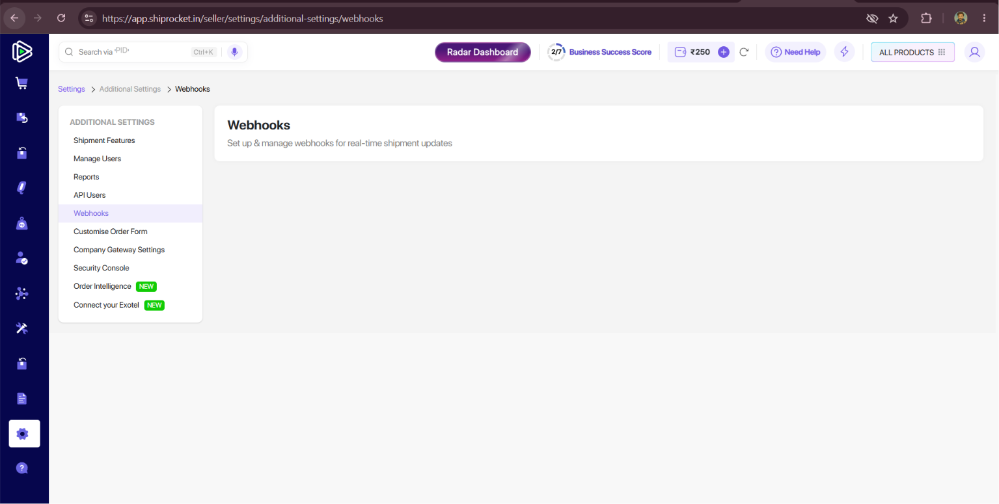
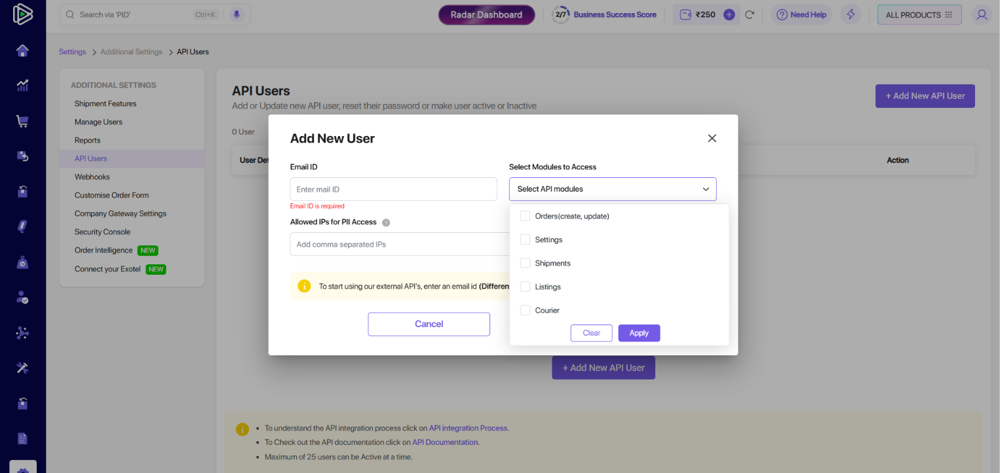
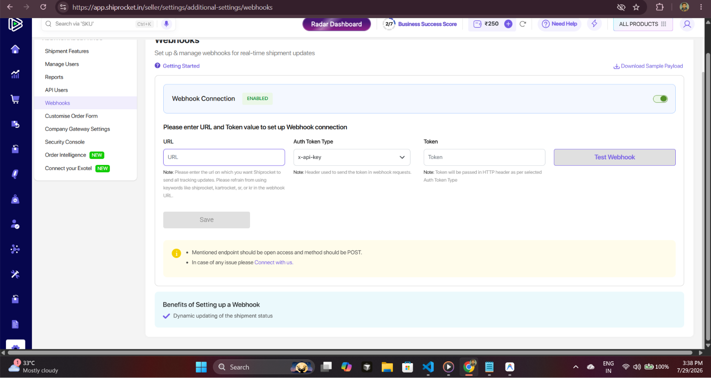
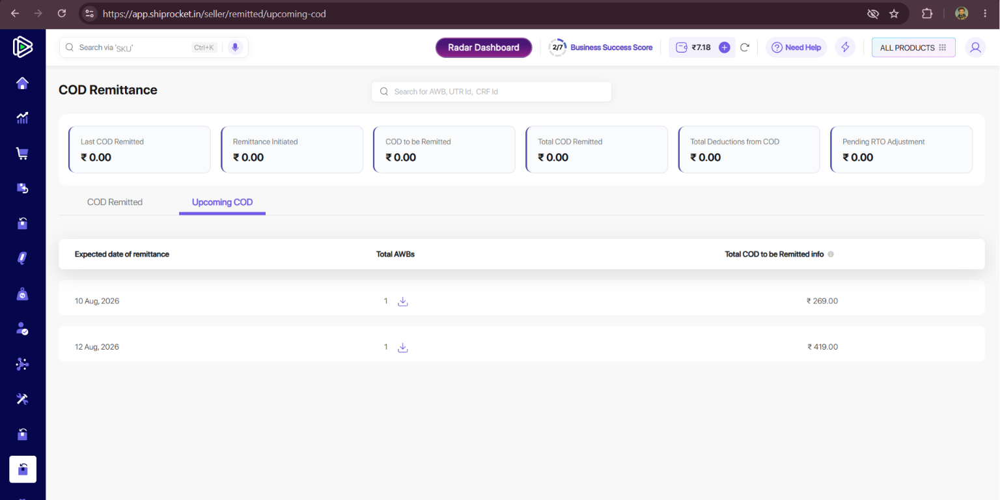
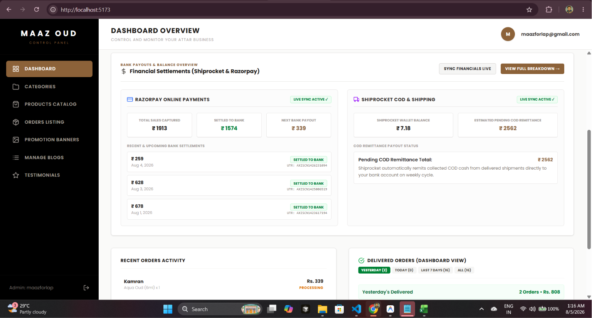

  I have reviewed all the screenshots in Todo.md and resolved the indexing and structured data issues.
  ──────
  ### 🔍 Analysis of Issues in Todo.md
  #### 1. Merchant Listings Structured Data Issues (Images 1–3)

  • Issue A: Invalid string length in field 'sku'
      • Cause: Google Search Console caps product sku string lengths at 50 characters. For bundle/combo items like pack-of-2-indian-luxury-attars-mitti-e-
      hind-and-khas-vetiver (60 chars) and pack-of-2-indian-luxury-attars-indian-oud-and-black-musk (56 chars), product.id exceeded 50 characters, triggering
      GSC errors.
      • Fix: Capped and truncated sku and mpn to a maximum of 50 characters across both server and client product schemas.
  • Issue B: Missing Merchant Listing recommended fields
      • Missing field 'hasMerchantReturnPolicy' (in 'offers')
      • Missing field 'shippingDetails' (in 'offers')
      • Missing field 'validFrom' (in 'offers')
      • Fix: Added complete Google Merchant Center compliant JSON-LD schemas for validFrom, shippingDetails (OfferShippingDetails), and
      hasMerchantReturnPolicy (MerchantReturnPolicy) inside the offers object in page.js and ProductClient.js.

  ──────
  #### 2. Page Indexing Issue: "Page with redirect" (Images 4–5)

  • Examples flagged in GSC: https://maazoud.in/about-us, http://maazoud.in/, https://maazoud.in/
  • Why this occurs & why validation failed:
      1. maazoud.in (non-www) is configured at the domain level to 301/308 redirect to https://www.maazoud.in/ (primary domain).
      2. Non-www URLs returning redirects is standard and correct SEO behavior—non-www URLs should not be indexed directly.
      3. When "Validate Fix" was clicked in GSC for https://maazoud.in/about-us, Google re-tested that non-www URL. Because it still redirected to
      https://www.maazoud.in/about-us (as expected), GSC reported "Some fixes failed".
  • Code Audit & Assurance:
      • Verified that all internal links, canonical tags (alternates.canonical), route.js, robots.js, route.js, and OpenGraph url properties strictly output
      canonical https://www.maazoud.in/... URLs without trailing slash inconsistencies.

  ──────
  ### 🛠️ Changes Made

  1. app/product/[slug]/page.js file:///D:/Live/oudwebsite/maazoud/app/product/%5Bslug%5D/page.js:
      • Truncated sku to max 50 chars (rawSku.slice(0, 50)).
      • Injected validFrom, shippingDetails, and hasMerchantReturnPolicy into offers.
  2. app/product/[slug]/ProductClient.js file:///D:/Live/oudwebsite/maazoud/app/product/%5Bslug%5D/ProductClient.js:
      • Updated client-side product schema to match the 50-character SKU limit and added complete merchant listing offer fields.

  ──────
  ### ⚡ Verification

  Ran next build to verify the codebase compiles cleanly with all page routes:

  • Result: ✓ Compiled successfully in 6.5s without errors.